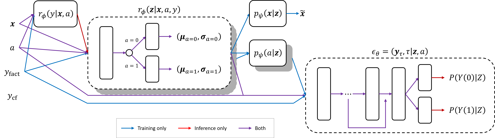

# Causally-Consistent Diffusion Models for Treatment Effect Estimation Under Latent Confounding

Observational treatment-effect estimators assume that every variable influencing both treatment
and outcome has been measured; in clinical data this fails routinely, and when it does, modern
estimators return confident, precise, and wrong effects with nothing in their diagnostics to
signal the failure.

This repository implements a **hybrid potential-outcome model** for the hidden-confounding setting.
It fuses the latent-confounder structure of CEVAE [(Louizos et al., 2017)](https://arxiv.org/abs/1705.08821)
with the diffusion-based outcome model of DiffPO [(Ma et al., 2024)](https://arxiv.org/abs/2410.08924):
a variational encoder infers a latent $\mathbf{z}$ from the covariates, treatment and factual outcome,
and a conditional diffusion denoiser -- conditioned on $\mathbf{z}$ rather than on the raw covariates --
learns the full joint distribution of both potential outcomes. Under injected hidden confounding on IHDP,
a naive diffusion baseline's error degrades substantially while the hybrid's is essentially unchanged;
a step-by-step analysis of the reverse diffusion process finds the mechanistic signature of confounding
largely absent in the hybrid.

## Method

**Why condition the denoiser on a latent?** The DiffPO diffusion model works by learning a conditional
outcome distribution and sampling potential outcomes from it. Conditioned on $\mathbf{x}$ and $a$,
the denoiser $\epsilon_\theta(y_\tau, \tau \mid \mathbf{x}, a)$ fits the *factual* conditional
$p(y \mid \mathbf{x}, a)$ -- the outcome distribution among the subjects in each $\mathbf{x}$-stratum
who actually received $a$. This equals the potential-outcome distribution $p(Y(a) \mid X)$ only when
treatment is as-good-as-random within an $\mathbf{x}$-stratum, i.e. $Y(a) \perp\!\!\!\perp A \mid \mathbf{x}$.

A hidden confounder breaks this: at fixed $\mathbf{x}$, the treated and untreated subjects differ
systematically on the unmeasured confounder, so the factual conditional carries that difference on
top of the treatment effect. The denoiser learns this biased distribution faithfully
-- it fits the observed data well -- and every potential outcome it samples inherits the bias,
with nothing in the loss to signal it. Conditioning instead on a latent $\mathbf{z}$ inferred from
$(\mathbf{x}, a, y)$ shifts the target to $p(y \mid \mathbf{z}, a)$; if $\mathbf{z}$ absorbs the
confounder, $Y(a) \perp\perp A \mid \mathbf{z}$ holds and this conditional is the potential-outcome
distribution the model should be sampling.

**`HybridModel`** (`src/model.py`) is trained by maximising a main objective $\mathcal{F}$ and,
beforehand, a pre-training objective $\mathcal{F}_\text{pretrain}$ for the auxiliary model:

```math
\begin{align*}
\mathcal{F}
    =& \underbrace{
        \mathbb{E}_{\mathbf{z} \sim r_\phi(\mathbf{z} \mid \mathbf{x}, a, y_0)}
        \left[ \log p_\psi(\mathbf{x} \mid \mathbf{z}) + \log p_\psi(a \mid \mathbf{z}) \right]
        - D_{\mathrm{KL}} \left( r_\phi(\mathbf{z} \mid \mathbf{x}, a, y_0) \parallel p(\mathbf{z}) \right)
    }_{\text{VAE reconstruction \& regularisation}}
    \\
    &- \underbrace{
        \mathbb{E}_{(y_0, \mathbf{z}, a);\,\tau;\,\epsilon}
        \left[
            \left\Vert \epsilon - \epsilon_\theta \left(
                \sqrt{\bar\alpha_\tau}\, y_0 + \sqrt{1 - \bar\alpha_\tau}\, \epsilon, \tau \mid \mathbf{z}, a
            \right) \right\Vert^2
        \right]
    }_{\text{noise-matching diffusion loss}} \\
\mathcal{F}_\text{pretrain} =& \underbrace{
        \log r_\phi(y_0 \mid \mathbf{x}, a)
    }_{\text{auxiliary prediction term }}
\end{align*}
```

The auxiliary head is frozen once $\mathcal{F}_\text{pretrain}$ has converged, so it does
not move while $\mathcal{F}$ is optimised.



- **Encoder** `r_φ(z|x,a,y)` -- a TARnet-split diagonal-Gaussian encoder: a shared trunk on
  `(x, y)`, with `a` selecting a treated or control head, so the `z` posterior may differ
  by arm (`src/encoder.py`);
- **Decoders** `p_ψ(x|z)`, `p_ψ(a|z)` -- reconstruct the covariates and treatment from `z`
  (`src/decoders.py`); the `a`-decoder doubles as the latent propensity model;
- **Denoiser** `ε_θ` -- a DiffPO-style residual-block denoiser predicting joint noise for
  `[y0, y1]`, conditioned on `z` and `a` (`src/denoiser.py`);
- **Auxiliary outcome model** `r_φ(y|x,a)` -- a small TARnet (`src/auxiliary.py`),
  pre-trained on the factual NLL and frozen, serving two roles: a leak-free counterfactual
  target for the denoiser, and the imputed outcome that lets the encoder run at test time
  when no `y` is observed.

Two mechanisms sit on top of the base objective:

- **z-space IPW** (`src/zspace_ipw.py`) -- the diffusion loss is reweighted by
  $w_{\hat{\pi}}(\mathbf{z},a) = \frac{a}{\hat{\pi}(\mathbf{z})} + \frac{1-a}{1 - \hat{\pi}(\mathbf{z})}$,
  with $\hat{\pi}(\mathbf{z})$ a multi-sample estimate from the $a$-decoder. Because $\hat{\pi}$
  depends on the still-training encoder, the weighting is stabilised with EMA copies of the encoder
  and $a$-decoder, a linear ramp that engages only after partial convergence, a two-timescale
  learning rate for the $a$-decoder, and asymmetric, arm-conditional weight trimming (trimmed
  subjects fall back to weight 1).
- **Counterfactual anchoring** -- only the factual outcome is observed. DiffPO fills the
  counterfactual slot with the simulator's ground-truth `y_cf` under a factual-only loss
  mask, but because the denoiser learns joint structure across the `[y0, y1]` slots, that
  is not leak-free. Instead the counterfactual slot is anchored (RA-learner style) to the
  frozen auxiliary head's prediction, through a soft gradient mask weighted by
  `cf_anchor_weight`.

**`DiffPO`** (`src/model.py`) is the baseline: the same denoiser stack conditioned directly
on `x`. It is not left uncorrected -- `experiment.py` always fits it with its own `x`-space
IPW, a pre-trained frozen `PropensityNet` (`src/propensity.py`) trained on the pooled
train+val+test covariates as in the DiffPO paper. That correction simply operates at the
`x` level, which is the wrong level when the confounder never appears among the regressors.

## Dataset

Experiments use a **reconstructed 985-subject "full" IHDP** population (Hill's respons surface
B [(Hill, 2011)](https://www.tandfonline.com/doi/epdf/10.1198/jcgs.2010.08162)), built by
`data/ihdp/make_full_ihdp.py` and committed under `data/ihdp/full/` (10 replications). This
deliberately replaces the standard NPCI benchmark, which excludes every treated infant with a
non-white mother (747 subjects, ~19% treated). Potential outcomes for the re-added treated
infants are rebuilt by fitting Hill's deterministic response surface on the 747 retained
subjects (an exact fit) and extrapolating.

`make_ihdp_confounded` (`src/data.py`) injects hidden confounding through `momblack` (a
binary covariate held out of the model inputs, only partly recoverable via proxies) with
two independent mechanisms:

1. **Direct outcome effect** -- `momblack` shifts the true potential outcomes by the same
   asymmetric rule Hill's surface B uses for every other covariate (multiplicative on `mu0`,
   additive on `mu1`);
2. **Treatment-selection effect** -- treatment is flipped for `momblack == 1` subjects, with
   `y`/`y_cf` swapped to stay consistent.

## Repository layout

| Path | Contents |
| --- | --- |
| `src/model.py` | `HybridModel`, `DiffPO`, shared `_DiffusionBase` (noise schedule, DDPM/DDIM reverse loops) |
| `src/encoder.py`, `src/decoders.py`, `src/auxiliary.py` | latent-variable stack components |
| `src/denoiser.py` | conditional diffusion denoiser |
| `src/zspace_ipw.py` | z-space IPW weight, ramp, ESS/calibration diagnostics |
| `src/propensity.py` | `PropensityNet` for the DiffPO baseline's x-space IPW |
| `src/data.py` | IHDP loading, splits, confounding injection |
| `src/metrics.py` | Wasserstein-to-truth, interval coverage/width, RMSE, √PEHE |
| `src/config.py` | pydantic config schema |
| `train.py` | shared training loop, auxiliary-head pre-training, IPW diagnostics |
| `experiment.py` | the 2×2 study runner |
| `config/ihdp.yaml` | the experiment configuration |
| `confounding_diffusion.ipynb`, `src/confounding_analysis.py` | mechanistic reverse-process analysis |
| `tests/` | pytest suite |

Other notebooks (`clipping_investigation`, `noise_schedule`, `po_imbalance`, `treatment_rate`, etc.) are exploratory investigations kept for completeness.

## Setup

Requires Python ≥ 3.14 and [uv](https://docs.astral.sh/uv/).

```bash
uv sync --dev
```

On Linux/Windows this pulls CUDA 13.0 PyTorch wheels (see `[tool.uv.sources]` in
`pyproject.toml`). `experiment.py` logs to Weights & Biases; run `wandb login` first, or
set `WANDB_MODE=offline`.

## Running the 2×2 experiment

The study crosses model family with data condition:

```bash
uv run python experiment.py --condition naive_full   # DiffPO,      clean IHDP
uv run python experiment.py --condition naive_conf    # DiffPO,      confounded IHDP
uv run python experiment.py --condition hybrid_full   # HybridModel, clean IHDP
uv run python experiment.py --condition hybrid_conf   # HybridModel, confounded IHDP
```

`--config` defaults to `config/ihdp.yaml`. Set `data.replication` there to a single index
or a list to run multiple IHDP replications in one invocation; the reported results use
replications `[1, 2, 3, 4, 5]` (the shipped config has `replication: 1` for a quick single
run). `data.confounder_effect` controls the injected confounding strength (Hill's
`{0, 0.1, …, 0.4}` grid). The hyperparameters in that file are set by hand and not tuned.
Each run writes:

- `results/results_<run_id>.json` -- config, `y_std`, validation and test metrics;
- `results/preds_<run_id>.csv` -- per-subject predictive summary statistics;
- `checkpoints/final_model_<run_id>.pth` -- the trained model;
- `logs/<condition>_<timestamp>.log` -- the run log.

## Evaluation and analysis

Test-time evaluation (`train.evaluate`) draws `K` potential-outcome samples per subject and
reports 1-Wasserstein distance to the true Gaussian potential-outcome law, 95%/99% interval
coverage and width, per-arm RMSE, and √PEHE (`src/metrics.py`). Results are de-normalised to
raw outcome units before logging.

`confounding_diffusion.ipynb` runs the mechanistic analysis for both families: a **forced
cross-evaluation** that holds a diffusion trajectory fixed and swaps only the model (and,
for the hybrid, its encoder-derived conditioning) to localise where and how confounding
perturbs the reverse process. It consumes trained checkpoints from all four conditions, so
the `experiment.py` runs come first. `src/confounding_analysis.py` holds the reusable
compute; the notebook keeps the plotting.

## Results (qualitative)

Under injected hidden confounding the naive DiffPO baseline's √PEHE degrades in every
replication, while the hybrid's shows no consistent movement -- a difference-in-differences
that survives correcting for the confounded estimand being intrinsically harder to estimate,
and that is accompanied by a large reduction in cross-replication variance. The forced
cross-evaluation agrees in direction: the treatment-flip-driven confounding signature visible
in the naive model's predicted-noise divergence is largely absent in the hybrid. The reduction
in the mechanistic footprint is smaller than the accuracy gain that accompanies it, and
per-subject divergence does not predict per-subject error for either model.

## Development

```bash
uv run pytest
uv run ruff check
uv run ruff format --check
```

CI runs all three on every pull request (`.github/workflows/python-ci.yaml`), along with
conventional-commit validation of the PR title.
